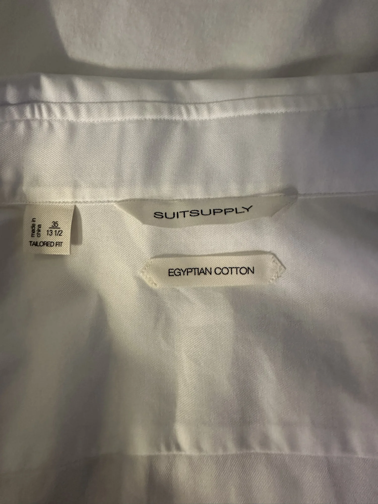

- **Brand:** Suitsupply
- **Product:** White Twill Tailored Fit Shirt — model H7003. Currently listed by Suitsupply as the Tailored Fit Cutaway Collar Shirt.
- **Fit:** Tailored Fit, as printed on the neck label.
- **Retirement reason:** Too small overall, as reported by the owner.
- **Size:** 35 / 13½, exactly as printed on the label. Numeric collar sizing; no letter-size or US/Asia conversion inferred.
- **Color:** White (official product color).
- **Material:** 100% Egyptian cotton; fabric by Albini, Italy, per the official H7003 product page.
- **Design:** Curved cutaway collar, single cuffs, French placket, long sleeves, and curved hem.
- **Care:** Official H7003 page says machine wash warm; follow the garment's care label if it differs.
- **Made in:** China, as printed on the size tag.
- **Quantity owned:** 1
- **Purchased:** August 24, 2024, from Suitsupply; quantity 1, size 13½, US$139.00 before tax. Receipt order PSUS01515385.
- **Identification:** The [purchase receipt](https://mail.google.com/mail/u/0/#search/suitsupply/FMfcgzQVzNtLcQNDQzmFCrBTzWtXcDfl) names White Twill Tailored Fit Shirt; its product link resolves directly to [official model H7003](https://suitsupply.com/en-us/men/shirts/white-cutaway-collar-shirt/H7003.html). The receipt size agrees with the owner's 35 / 13½ neck label.
- **Thumbnail source:** Official H7003 front product photograph, background removed with AI image editing. Original garment-label photo retained below as supporting evidence.

### Label reference

